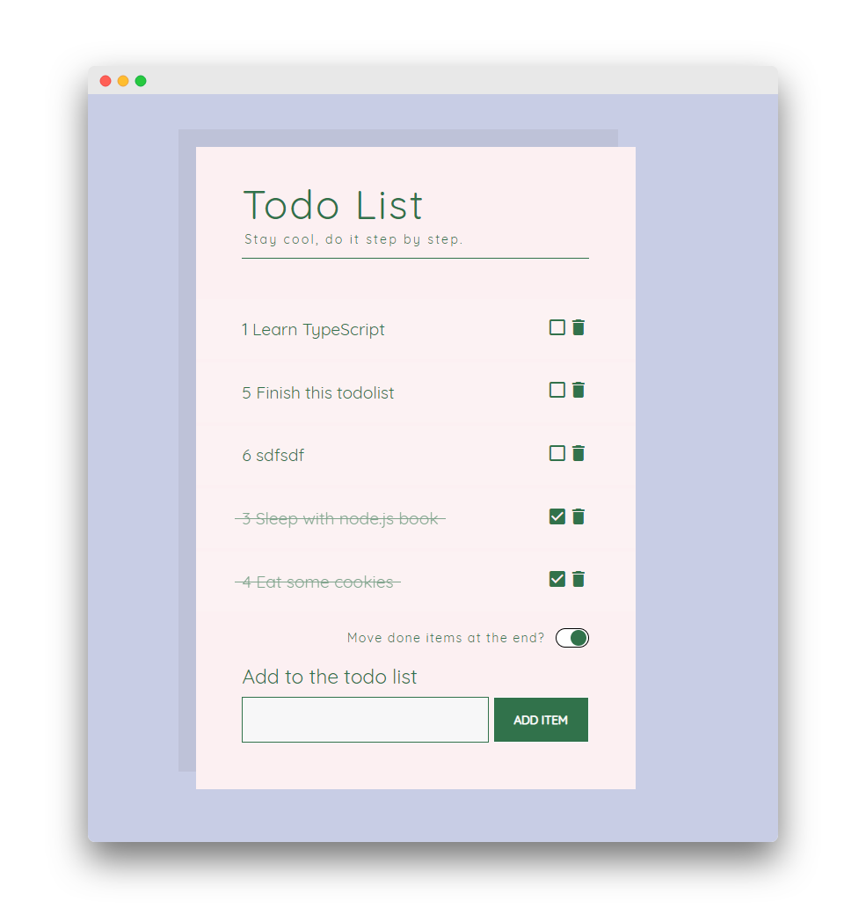

# Todolist

Simple todolist application using Angular 7.

I made this application to learn Angular, it's really basic but it's only to begin with. Feel free to use it, read the code, optimise, all you want with this repo ! If you have any advice contact me !

# Features

* Add tasks
* Delete tasks.
* Mark as done/undone task.
* Move done items at the end.

# Run application

* `git clone` to download this repo
* `ng serve --open` to launch this app

# Some possible improvements

If you want practice using this base code you can add :

* add an archive tasks feature
* add a view for them
* add label and filter feature

# Author
For the design I took the [Saawsann](https://twitter.com/saawsann) css, the objective was to practice only Angular here. You can find his work [here](https://codepen.io/saawsan/pen/jayzeq?editors=0100).

snutij